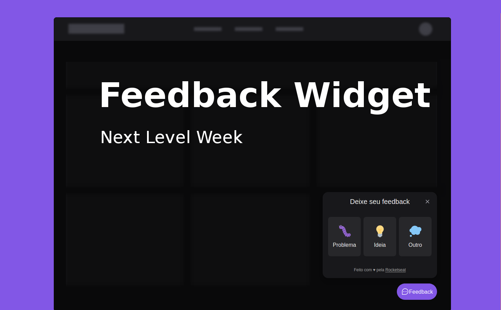

<h1 align="center"> Feedback Widget
<br>
<br>
<a href="https://rocketseat.com.br">
  
</a>
<a href="https://linkedin.com/in/gabriel-rossales-a01a51185">
  
</a>
</h1>

<p align="center">
  <a href="#overview">Overview</a> |
  <a href="#build-with">Build With</a> |
  <a href="#prerequisites">Prerequisites</a> |
  <a href="#getting-started">Getting Started</a> 
</p>

## Overview
FeedbackWidget is a Widget component that can be used in web and mobile applications to receive feedback from users.

## Build With
 - [ReactJS](https://reactjs.org)
 - [React Native](https://reactnative.dev/)
 - [TypeScript](https://www.typescriptlang.org/)
 - [TailWind CSS](https://tailwindcss.com/)
 - [Headless UI](https://headlessui.dev/)
 - [Prisma](https://www.prisma.io/)
 - [Jest](https://jestjs.io/)
 - [Mailtrap](https://mailtrap.io/)

## Prerequisites
  - [NodeJS](https://reactjs.org)

## Getting Started
  ```sh 
  # Clone this repo
  $ git clone https://github.com/gRossales/nlw-return-impulse.git
  # Install dependencies from sever and web folder with 
  $ npm install
  # Inside web folder create a .env.local file with your database URL
  VITE_API_URL=""
  # Inside server folder crete a .env file with your database path
  DATABASE_URL=""
  ```
